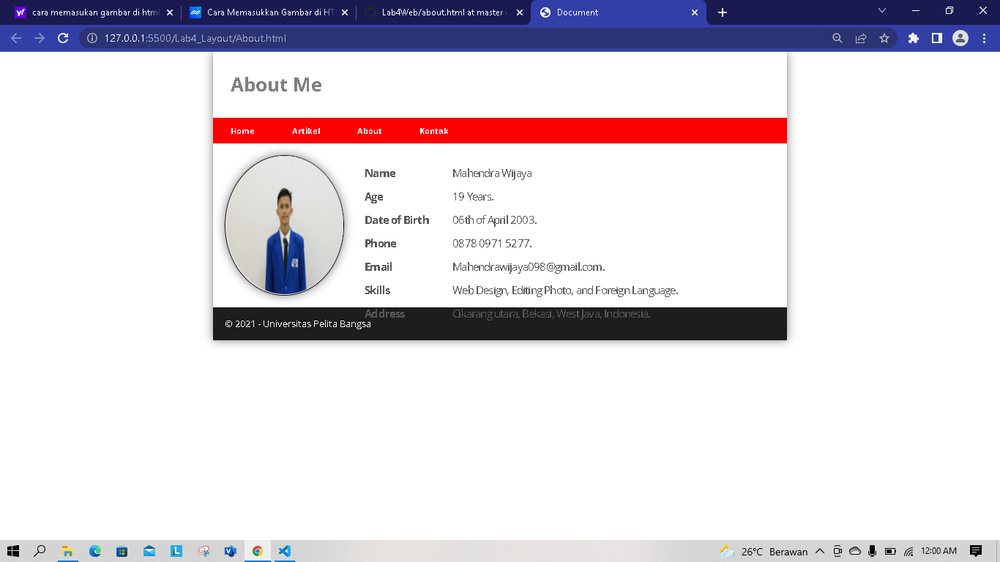

# Lab 4 Web
## 1. membuat Box Element


disini telah di buat box element dengan tag div dan juga dengan CSS FLOAT PROPERTFY

``` html
<section>
    <div class="div1">Div 1</div>
    <div class="div2">Div 2</div>
    <div class="div3">Div 3</div>
</section>
```

``` css
style>
        div {
            float: left;
            padding: 10px;
        }

        .div1 {
            background: red;
        }

        .div2 {
            background: yellow;
        }

        .div3 {
            background: green;
        }
    </style>
```

## 2. Mengatur Clearfix Element


menambahkan element tag div dan juga css clear yang kemudian floatnya di none

``` html
<div class="div4">Div 4</div>
```

``` css
<style>
.div4{
           background-color: blue;
           clear: left;
           float: none;
       }
</style>
```

## 3. Membuat Kerangka Layout


disini telah di buat kerangka layout sederhana

``` html
<!DOCTYPE html>
<html lang="en">

<head>
    <meta charset="UTF-8">
    <meta http-equiv="X-UA-Compatible" content="IE=edge">
    <meta name="viewport" content="width=device-width, initial-scale=1.0">
    <title>Layout Sederhana</title>
</head>

<body>
    <div id="container">
        <header>
            <h1>Layout Sederhana</h1>
        </header>
        <nav>
            <a href="home.html" class="active">Home</a>
            <a href="artikel.html">Artikel</a>
            <a href="about.html">About</a>
            <a href="kontak.html">Kontak</a>
        </nav>
        <section id="hero"></section>
        <section id="wrapper">
            <section id="main"></section>
            <aside id="sidebar"></aside>
        </section>
        <footer>
            <p>&copy; 2022 - Universitas Pelita Bangsa</p>
        </footer>
    </div>
</body>

</html>
```

## 4. Menambahkan Css Layout


Ditambahkan css layout pada css ekternal

``` css
/* import google font */
@import
url('https://fonts.googleapis.com/css2?family=Open+Sans:ital,wght@0,300;0,400;0,600;0,700;0,800;1,300;1,400;1,600;1,700;1,800&display=swap');
@import
url('https://fonts.googleapis.com/css2?family=Open+Sans+Condensed:ital,wght@0,300;0,700;1,300&display=swap');
/* Reset CSS */
* {
    margin: 0;
    padding: 0;
    }
    body {
    line-height:1;
    font-size:100%;
    font-family:'Open Sans', sans-serif;
    color:#5a5a5a;
    }
    #container {
    width: 980px;
    margin: 0 auto;
    box-shadow: 0 0 1em #cccccc;
    }
    /* header */
    header {
    padding: 20px;
    }
    header h1 {
    margin: 20px 10px;
    color: #b5b5b5;
    }
```

## 5. Membuat Navigasi


Menambahkan navigasi di css 

``` css
/* navigasi */
nav {
    display: block;
    background-color: #1f5faa;
    }
    nav a {
    padding: 15px 30px;
    display: inline-block;
    color: #ffffff;
    font-size: 14px;
    text-decoration: none;
    font-weight: bold;
    }
    nav a.active,
    nav a:hover {
    background-color: #2b83ea;
```

## 6. Membuat Hero Panel


membuat hero panel

``` css
/* Hero Panel */
#hero {
    background-color: #e4e4e5;
    padding: 50px 20px;
    margin-bottom: 20px;
    }
    #hero h1 {
    margin-bottom: 20px;
    font-size: 35px;
    }
    #hero p {
    margin-bottom: 20px;
    font-size: 18px;
    line-height: 25px;
    }
```

## 7.Mengatur Layout Main Dan Siddebar


disini sudah mengatur layout main dan sidebar

``` css
/* main content */
#wrapper {
    margin: 0;
    }
    #main {
        float: left;
        width: 640px;
        padding: 20px;
        }
        /* sidebar area */
        #sidebar {
        float: left;
        width: 260px;
        padding: 20px;
```

## 8. Membuat Sidebar Widget


menambahkan sidebar widget pada html dan css

``` html
<aside id="sidebar">
                <div class="widget-box">
                    <h3 class="title">Widget Header</h3>
                    <ul>
                        <li><a href="#">Widget Link</a></li>
                        <li><a href="#">Widget Link</a></li>
                        <li><a href="#">Widget Link</a></li>
                        <li><a href="#">Widget Link</a></li>
                        <li><a href="#">Widget Link</a></li>
                    </ul>
                </div>
                <div class="widget-box">
                    <h3 class="title">Widget Text</h3>
                    <p>Vestibulum lorem elit, iaculis in nisl volutpat, malesuada tincidunt
                        arcu. Proin in leo fringilla, vestibulum mi porta, faucibus felis. Integer
                        pharetra est nunc, nec pretium nunc pretium ac.</p>
                </div>
            </aside>
```

``` css
/* widget */
.widget-box {
    border:1px solid #eee;
    margin-bottom:20px;
    }
    .widget-box .title {
    padding:10px 16px;
    background-color:#428bca;
    color:#fff;
    }
    .widget-box ul {
    list-style-type:none;
    }
    .widget-box li {
    border-bottom:1px solid #eee;
}
.widget-box li a {
padding:10px 16px;
color:#333;
display:block;
text-decoration:none;
}
.widget-box li:hover a {
background-color:#eee;
}
.widget-box p {
padding:15px;
line-height:25px;
}
```

## 9. Mengatur Footer


Menambahkan footer pada bagian css

``` css
/* footer */
footer {
    clear:both;
    background-color:#1d1d1d;
    padding:20px;
    color:#eee;
    }
```

## 10. Menambahkan Element Pada Main Content


Disini telah di tambahkan file html dan css pada main content

``` html
<div class="row">
                    <div class="box">
                        
                        <h3>Heading</h3>
                        <p>Donec sed odio dui. Etiam porta sem malesuada magna mollis
                            euismod.</p>
                        <a href="#" class="btn btn-default">View detail</a>
                    </div>
                    <div class="box">
                        
                        <h3>Heading</h3>
                        <p>Donec sed odio dui. Etiam porta sem malesuada magna mollis
                            euismod.</p>
                        <a href="#" class="btn btn-default">View detail</a>
                    </div>
                    <div class="box">
                        
                        <h3>Heading</h3>
                        <p>Donec sed odio dui. Etiam porta sem malesuada magna mollis
                            euismod.</p>
                        <a href="#" class="btn btn-default">View detail</a>
                    </div>
                </div>
```

``` css
/* box */
.box {
    display:block;
    float:left;
    width:33.333333%;
    box-sizing:border-box;
    -moz-box-sizing:border-box;
    -webkit-box-sizing:border-box;
    padding:0 10px;
text-align:center;
}
.box h3 {
margin: 15px 0;
}
.box p {
line-height: 20px;
font-size: 14px;
margin-bottom: 15px;
}
box img {
border: 0;
vertical-align: middle;
}
.image-circle {
border-radius: 50%;
}
.row {
margin: 0 -10px;
box-sizing: border-box;
-moz-box-sizing: border-box;
-webkit-box-sizing: border-box;
}
.row:after, .row:before,
.entry:after, .entry:before {
content:'';
display:table;
}
.row:after,
.entry:after {
clear:both;
}
```

## 11. Menambahkan Artikel Di Main


disini menambahkan element dengan section artikel dan pada css nya juga

``` html
<hr class="divider" />
                <article class="entry">
                    <h2>First featurette heading.</h2>
                    
                    <p>Lorem ipsum dolor sit amet, consectetur adipiscing elit. Vestibulum lorem
                        elit, iaculis in nisl volutpat, malesuada tincidunt arcu. Proin in leo fringilla,
                        vestibulum mi porta, faucibus felis. Integer pharetra est nunc, nec pretium nunc
                        pretium ac.</p>
                </article>
                <hr class="divider" />
                <article class="entry">
                    <h2>First featurette heading.</h2>
                    
                    <p>Lorem ipsum dolor sit amet, consectetur adipiscing elit. Vestibulum lorem
                        elit, iaculis in nisl volutpat, malesuada tincidunt arcu. Proin in leo fringilla,
                        vestibulum mi porta, faucibus felis. Integer pharetra est nunc, nec pretium nunc
                        pretium ac.</p>
                </article>
```

``` css
divider {
    border:0;
    border-top:1px solid #eeeeee;
    margin:40px 0;
    }
    /* entry */
    .entry {
    margin: 15px 0;
    }
    .entry h2 {
    margin-bottom: 20px;
}
.entry p {
line-height: 25px;
}
.entry img {
float: left;
border-radius: 5px;
margin-right: 15px;
}
.entry .right-img {
float: right;
}
```

# PERTANYAAN DAN TUGAS

1. Ini hasilnya


html nya

``` html
<!DOCTYPE html>
<html lang="en">
<head>
    <meta charset="UTF-8">
    <meta http-equiv="X-UA-Compatible" content="IE=edge">
    <meta name="viewport" content="width=device-width, initial-scale=1.0">
    <title>Document</title>
    <link rel="stylesheet" href="style.css">
</head>
<body>
    <div id="container">
        <header>
            <h1>About Me</h1>
        </header>
        <nav>
            <a href="home.html">Home</a>
            <a href="home.html">Artikel</a>
            <a href="about.html">About</a>
            <a href="kontak.html">Kontak</a>
        </nav>
        <section class="cont-about">
            <div class="bio">
                
                <div class="list desc1">
                    <h3>Name</h3>
                    <h3>Age</h3>
                    <h3>Date of Birth</h3>
                    <h3>Phone</h3>
                    <h3>Email</h3>
                    <h3>Skills</h3>
                    <h3>Address</h3>
                </div>
                <div class="list desc2">
                    <h3>Mahendra Wijaya</h3>
                    <h3>19 Years.</h3>
                    <h3>06th of April 2003.</h3>
                    <h3>0878 0971 5277.</h3>
                    <h3>Mahendrawijaya098@gmail.com.</h3>
                    <h3>Web Design, Editing Photo, and Foreign Language.</h3>
                    <h3>Cikarang utara, Bekasi, West Java, Indonesia.</h3>
                </div>
            </div>
        </section>
        <footer>
            <p>&copy; 2021 - Universitas Pelita Bangsa</p>
        </footer>
    </div>
</body>
</html>
```

css nya

``` css
.cont-about{
    padding: 50px 0px;
}
.bio{
    display: flex;
    flex-direction: row;
}
.bio img{
    margin: 20px;
    border: 2px solid #1d1d1d;
    border-radius: 50%;
    box-shadow: 0px 0px 1em gray;
}
.list{
    position: relative;
    top: 30px;
    left: 15px;
}
.list h3{
    line-height: 40px;
    letter-spacing: -1px;
}
.desc1{
    width: 150px;
}
.desc2 h3{
    font-weight: normal;
}
```

2. ini hasilnya


html nya

```html
<!DOCTYPE html>
<html lang="en">
<head>
    <meta charset="UTF-8">
    <meta http-equiv="X-UA-Compatible" content="IE=edge">
    <meta name="viewport" content="width=device-width, initial-scale=1.0">
    <title>Document</title>
    <link rel="stylesheet" href="style.css">
</head>
<body>
    <div id="container">
        <header>
            <h1>Contact Me</h1>
        </header>
        <nav>
            <a href="home.html">Home</a>
            <a href="artikel.html">Artikel</a>
            <a href="about.html">About</a>
            <a href="kontak.html">Kontak</a>
        </nav>
        <section id="kontak">
            <div class="login">
                <input type="text" placeholder="Your Name" class="input">
                <input type="text" placeholder="Your Email" class="input">
            </div>
            <div class="subject">
                <input type="text" placeholder="Subject" class="input">
            </div>
            <div class="msg">
                <textarea name="Message" id="Message" cols="35" rows="10" class="area" class="input"
                    placeholder="Your Message"></textarea>
            </div>
            <button type="submit">Send</button>
        </section>
    </div>
</body>
</html>
```

Ini css nya

``` css
#kontak{
    background-color: whitesmoke;
    padding: 20px 20px;
    margin-bottom: 20px;
}
.input,
.msg, .area{
    width: 100%;
    padding: 10px;
    border: 1px solid rgb(255, 0, 0);
    box-sizing: border-box;
    font-size: 15px;
    margin-bottom: 20px;
    
}
button{
    font-size: 15px;
    background-color: red;
    color: white;
    border-radius: 5px;
    padding: 10px 20px;
    margin-top: 8px;
}
button:hover{
    opacity: 0,9;
}
```